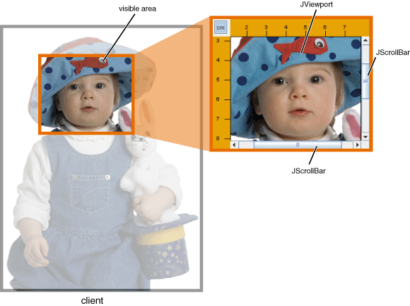
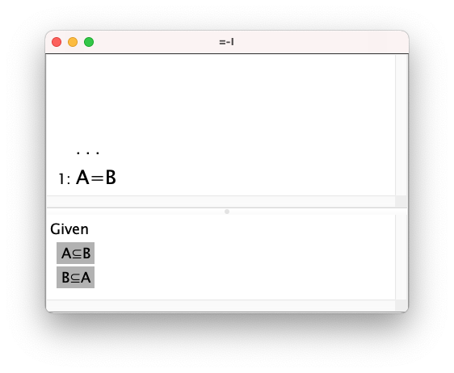
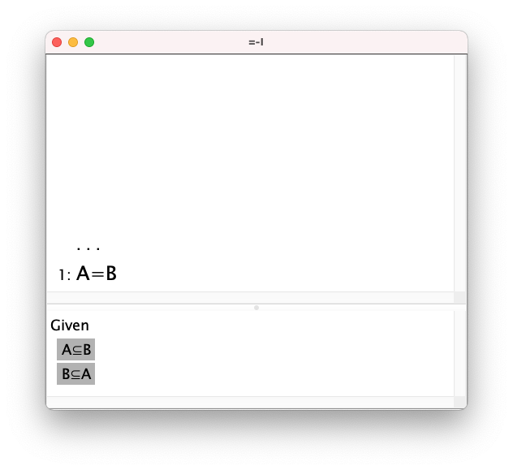
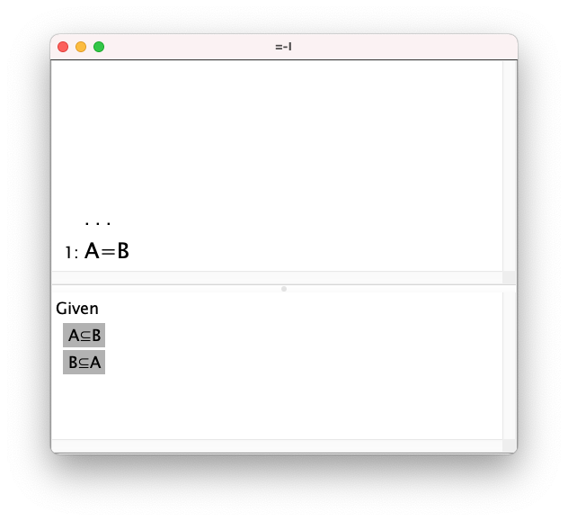
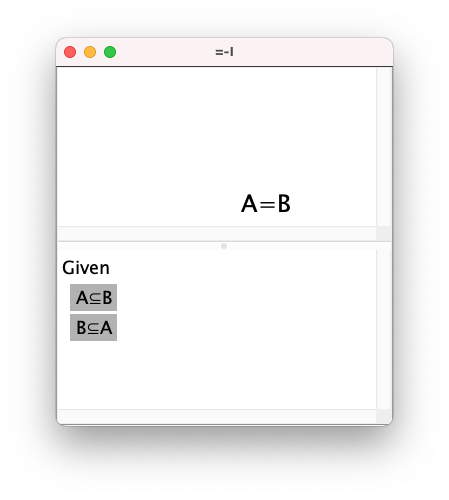

# Coordinates and Viewports

A Java scroll pane (JScrollPane) shows a view of a container. Something like this: 

The origin of the picture is (0,0) and at the top left of the picture. The origin of the scroll pane is (i,j) where 0<=x\<(picture width-pane width) and 0<=j<=(picture height-pane height). Actually i and j can be a little larger than that: especially when showing a short text file in a large window we are used to having white space at left and/or right. But not, note, above or left. The scroll bars in a scroll pane are only there if there is part of the container which can't be seen in the viewport.

But scroll panes in Jape proof windows are not all like that. A proof window has, in general, two panes: a proof window above and a proviso window below (when it gets to disproof this gets more complicated, so for the moment I'll stick to two)

In this example neither window needs scroll bars, because the thing they are showing fits within the window. The proviso pane is a totally normal scroll pane, showing a scrolled view of a sequence of lines. But the proof window is not standard. If it's made larger

then the proof pane gets larger, and the proof sticks to the bottom of the pane -- i.e. moving downwards. If the proviso pane is enlarged

then the proof goes upwards, still sticking to the bottom of its pane, and the Givens go upwards, sticking to the top of their pane.

Clearly the box-style proof is in a viewport where the *bottom left* of the viewport is the origin, and any space is above and to the right; the Givens are in a viewport where the *top left* is the origin, and any space is below and to the right.

If the proof is in tree style it's even odder: the origin is the *bottom middle* of the proof pane. For example this beginning proof

has the root formula near the bottom middle of the window, and if the window shrinks

then the root tries to stick to the bottom middle of the pane. It doesn't get it quite right because there are bugs involved. Oh dear oh dear.

### It gets worse

Java does everything in coordinates which start top left and increase downwards and rightwards, and are never negative. Jape *used to* design proof layouts in Cartesian coordinates, increasing rightward and upwards, with an origin bottom left for box proofs, bottom middle for tree proofs, and the x coordinate at least could be negative. But at some stage I went over to Java coordinates in proof design, hoping (I suppose) that I would then make fewer mistakes. Well maybe ...

### And then a crunching bug

It all suddenly stopped working properly. The example in the pictures above crashes in various circumstances. The accommodation made in Java to try to get an upside-down scroll pane working is so complicated that I can no longer understand it. The proof engine doesn't understand it either, and is prone to say that it's so confused that it can no longer go on. 

## Ho hum. Time for a rethink?

Not quite yet. I can still double-click on conclusions and things, and although the picture isn't always quite right, it's pretty good. So something is working, and it's just a matter of finding out what it's doing and why Displaystyle.showProof.handleinvis is getting it wrong ...

Richard Bornat
2021/10/05

